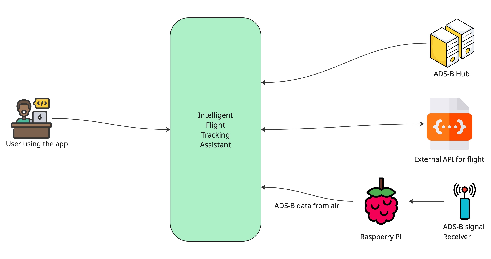

# Architecture

You can find our software architecture documentation for system requirements in this document.

First, the context diagram of our system and external elements is as follows.

Second, this is a deployment view that shows the infrastructure for each components.

This deployment view shows how the system separates data collection and visualization across distributed components.

<table>
<tr><td align="center"><a href="./architecture/Deployment_View.md">Deployment view 
</a></td></tr>
</table>

This following module view presents a refactoring of the legacy DisplayGUI architecture into a layered and decoupled structure, aiming to eliminate cyclic dependencies and improve maintainability, testability, and adherence to design principles.

<table>
  <tr>
  <td align="center"><a href="./architecture/Layered_Module_View.md">Layered Module View 
        </a>
  </td>
</tr>
</table>

The architecture views below are the main contents of system software architecture.

The following view illustrates how aircraft rendering is optimized using a clustering strategy that aggregates aircraft by screen region, reducing load and improving visual clarity.

<table>
<tr>
  <td align="center"><a href="./architecture/Aggregated_Aircraft_Rendering_C&C_View.md#component--connector-cc-view">Aggregated Aircraft Rendering - C&C view 
        </a>       
      </td>
  </tr>
</table>

The last view demonstrates how moving TCP connection logic into a dedicated thread improves UI responsiveness by applying the “Introduce Concurrency” tactic.

<table>
<tr>
  <td align="center"><a href="./architecture/Separation_of_TConnectionThread_C&C_View.md">Separation of TConnectionThread -C&C View 
        </a>
  </td>
</tr>

</table>

