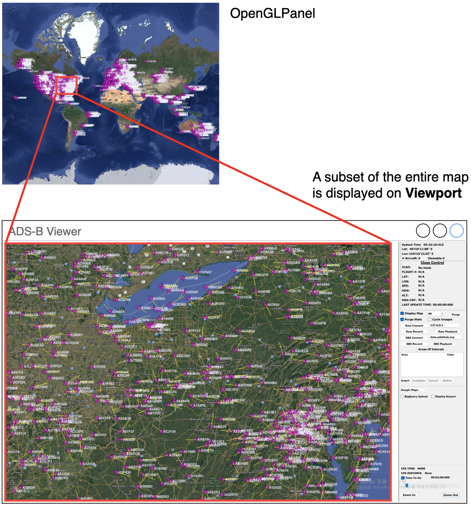
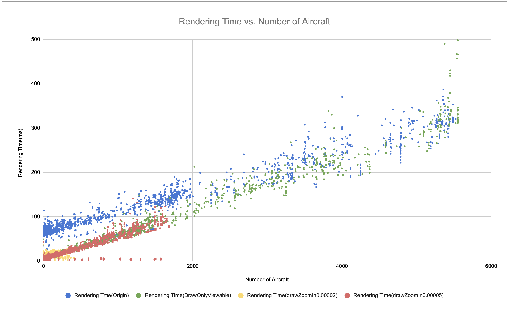

# Experiment 1: Performance Test based on the number of aircraft 

## Results and recommendations 

### Current Behavior:
- The map area is repainted every 500ms by timer event  
- In each repaint phase, all tracked aircraft, including those outside the viewport, are rendered on the OpenGL panel  

### Experiment Conditions  
- Origin : Map rendering time on original source code  
- DrawOnlyViewable : Render aircrafts only in the viewport  
- DrawZoomIn0.00002 : Render when zoom-in (Number of aircraft is between 200 and 300)  
- DrawZoomIn0.00005 : Render when zoom-in (Number of aricraft is between 1700 and 1800)  

### Observation
- Rendering time increases proportionally with the number of objects rendered
- Lag was observed when the map was moved with more than 2,000 objects rendered
- Limiting the number of displayed objects to under 1800 helps keep the rendering time below 100ms  
- Too many aircraft rendered on the map can negatively impact user experience  
  (Users can only view the distribution and are expected to zoom in to identify individual aircraft.)
  

### Conclusion  
To achieve quality attribute QAR_001_01, QAR_001_02, rendering time must be maintained under a specified limit  

#### Application of Tactic : Aggregate
Aggregation is mainly used for usability but can also improve performance in our case.
#### How to
1. Only display aggregated representations (e.g., circle markers with counts) when the zoom level is low.  
2. Render aircraft only when the map is zoomed in (only a few aircraft are visible in the viewport)  

Aggregation enables improvements in both performance and usability.  

  

  

## Objective 
It is natural to be concerned that system performance may degrade as the number of tracked aircraft increases.
The objective of this experiment is to determine how many aircraft the current system can handle while maintaining an acceptable screen update rate and user interaction responsiveness.
The results will help identify system performance thresholds, bottlenecks, and areas that require optimization.

## Status
[Planned | In progress | Suspended | Canceled | ***Concluded***]

## Expected outcomes
 - Performance test logs and statistical data
 - Graphs showing performance changes according to the number of aircraft

## Resources required
 - Software: Flight Tracker client

 - Hardware: One test laptop (Intel Core i7-1165G7 @ 2.80GHz / 16.0GB RAM)

 - Test data: Pre-recorded simulation files for different aircraft counts
   (50 / 100 / 200 / 300 / 500 / 1000 / 3000 / 5000 )
   
 - UI automation macro scripts

 - Personnel: 2 people × 4 hours
   
   (1 for test execution, 2 for preparation and support)

## Experiment description
- Test Environment Setup

  Generate pre-recorded test data (using AI tools if needed)

  Implement logging functionality for screen update and user response time

- Logging under Normal Usage

  Playback recorded test data

  Move map(drag), Zoom in/out(scrool), Click aircraft

- Log Analysis and Visualization

  Organize collected logs and measured data

  Visualize results as graphs

  Identify performance thresholds and bottlenecks

  Detect any abnormal behavior under load

- Conclusion and Review

  Summarize the findings in a final report
  
  Propose improvements based on analysis
  
  Plan follow-up experiments if necessary

## Duration
Start Date: June 10, 2025

End Date: June 12, 2025

## Assignee

Jaeyong Jeong, Seungsoon Lee

## Links and references

Technical risk [TR2](../architectural-drivers.md#technical-risk-assessment)

[ADR 01](../ADRs/ADR01-viewport-and-aggregation.md) 

Software Architecture in Practice – Chapter 11: Performance Tactics
