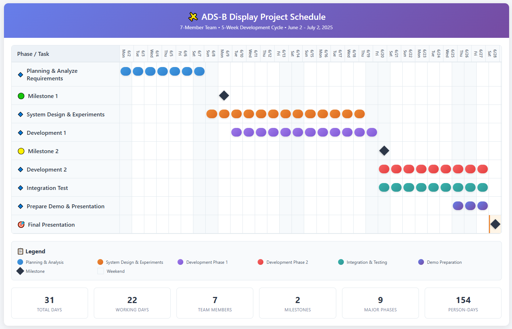

# Project Plan

This document presents the project's name, purpose, schedule, members, list of tasks, tools used, and goals.

It may be updated as the project progresses.

## Project Overview

- **Project Name** : Intelligent Flight Tracking Assistance - IFTA

- **Objective** : Improve a system that meets the objectives and requirements of the Federal Aviation Administration (FAA) issued request for proposal (RFP).

- **Scope** : Windows based GUI application

## Timeline & Milestones

Below is a summary schedule and you need to refer to the task list. Some items may be added or changed.

| **Phase**                            | **Duration** | **Key Deliverables**      |
| ------------------------------------ | ------------ | ------------------------- |
| 🔹 Planning & Analyze Requirements    | 6/2 ~ 6/8    | Architectural Drivers     |
| **🟢 Milestone 1**                    | **6/10**     | Documents                 |
| 🔹 System Design & Experiments        | 6/9 ~ 6/20   | Architecture              |
| 🔹 Development 1 - Mandatory features | 6/11 ~ 6/22  | TBD (Before Milestone 2)  |
| **🟡 Milestone 2**                    | **6/23**     | Documents                 |
| 🔹 Development 2 - Desired features   | 6/23 ~ 7/1   | TBD (After Milestone 2)   |
| 🔹 Integration & Test                 | 6/23 ~ 7/1   | Test Results              |
| 🔹 Prepare Demo & Presentation        | 6/29 ~ 7/1   | Presentation Slides       |
| **🎯 Milestone 3**                    | **7/2**      | Demo & Final Presentation |

<!--  -->

## Team Roles

Below is a summary and you need to refer to the task list. Some changes may apply.

| Role               | Name          | Responsibility                                            |
| ------------------ | ------------- | --------------------------------------------------------- |
| Project Manager    | Yongshik Bae  | Management, Communication, Development - *metadata*       |
| Software Developer | Sujin Kim     | Development - focus on *UI/UX*                            |
| Software Developer | Navnit Kumar  | Development - focus on *Map provider*                     |
| Software Developer | Jaeyong Jeong | Development - focus on *Response time & resiliency*       |
| Software Developer | Sangyeob Na   | Development - focus on *Time series analysis*             |
| Software Developer | Seungsoon Lee | Development - focus on *Response time & resiliency*       |
| Developer, DevOps  | Youngtae Kim  | Operation, Documentation, Development - *safety analysis* |

## Tasks

### 1. Planning & Setup

- [x] Read project description carefully
- [x] Configure Miro board and GitHub organization
- [x] Divide roles

### 2. Architecture

- [x] Derive functional requirements and quality attribute requirements
- [x] Make architectural drivers
- [ ] Create each view diagram (This item will be updated in detail after class.)

### 3. Services Development

Since there are many items to be implemented, the detailed status of each is updated on the [Miro Board](https://miro.com/app/board/uXjVIuV4obA=/?moveToWidget=3458764631066687663&cot=14).

- [ ] Analyze current code and requirements
- [ ] Make experiments for design decisions
- [ ] Describe detailed scenarios
- [ ] Development of each features - refer to Miro board.

### 4. Technical Experiments

- [ ] Evaluate performance of original codes according to the number of aircrafts
- [ ] Analyze real-time aircraft data ingestion rate and volume via ADS-B hub
- [ ] UI input stress test (System Behavior Under Rapid Button Clicks)
- [ ] TODO - test for reducing risk

### 5. Quality Assurance & Release

- [x] Make deliverables for Milestone 1
- [ ] Make deliverables for Milestone 2
- [ ] Integration tests
- [ ] Release final documents and presentation

## Tools & Technologies

- **Language** : C++
- **IDE** : C++ Builder

- **CI/CD**: GitHub

- **Monitoring** : Not Applicable  

- **Project Management** : Miro board

- **Communication** : MS Teams 

## Goals

- Develop 100% of mandatory features within the schedule
- Develop as many desired features as possible
- SW architecture satisfying the derived Quality Attributes
